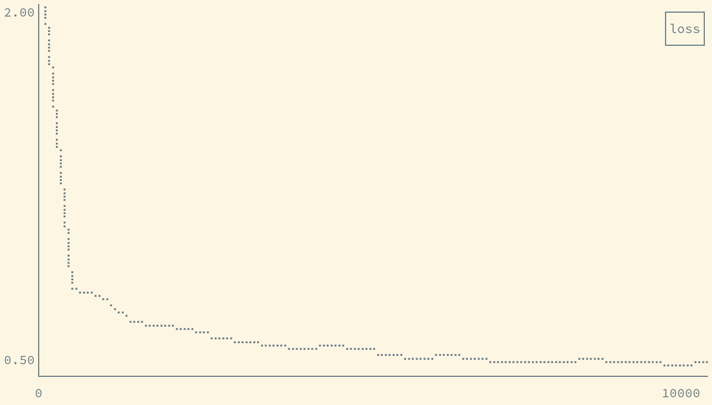

# tensorboard-peek

Peek at a Tensorboard scalar on the command line.

## Usage

Build the program with `cargo run --release`. Any terminal supported by [Crossterm](https://github.com/crossterm-rs/crossterm) should work.

`tensorboard-peek EVENTS_FILE` will print all the scalars found in the file. `tensorboard-peek EVENTS_FILE SCALAR_TAG` will show a line graph of the given scalar, with steps on the x-axis. Press <kbd>Esc</kbd> or <kbd>Q</kbd> to close the graph.

## License

MIT
